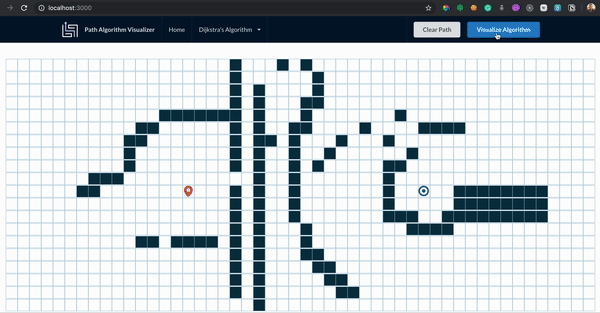

# Path Algorithms Visualizer

## Overview

An intuitive approach to path visualization algorithms using React!

## Algorithms

### Dijkstra's Algorithm

Dijkstra's algorithm is an algorithm for finding the shortest paths between nodes in a graph. It was conceived by computer scientist Edsger W. Dijkstra in 1956 and published three years later.

The algorithm exists in many variants. Dijkstra's original algorithm found the shortest path between two given nodes,[4] but a more common variant fixes a single node as the "source" node and finds shortest paths from the source to all other nodes in the graph, producing a shortest-path tree.

For a given source node in the graph, the algorithm finds the shortest path between that node and every other. It can also be used for finding the shortest paths from a single node to a single destination node by stopping the algorithm once the shortest path to the destination node has been determined. For example, if the nodes of the graph represent cities and edge path costs represent driving distances between pairs of cities connected by a direct road (for simplicity, ignore red lights, stop signs, toll roads and other obstructions), Dijkstra's algorithm can be used to find the shortest route between one city and all other cities.

Edsger W Dijkstra

## Usage

git clone the project and type `npm start` in the terminal.
Website available soon.

## ToDO

- ~~Add Dijkstra's Algorithm~~
- Add DFS
- Add BFS
- Add A\* Search
- Improve User Interface
- Launch website
- ...

## Author

FranckNdame, franck.mpouli@yahoo.com

## Contributing

Forks, patches and other feedback are welcome.
